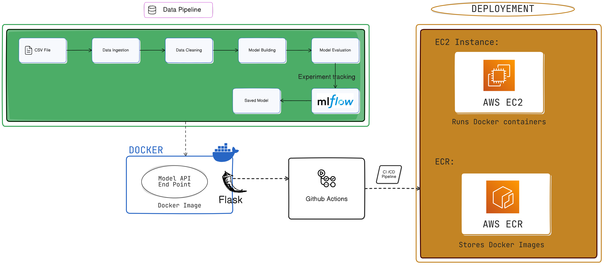

# Financial Fraud Detection MLOps
## Overview
In the rapidly evolving financial landscape, fraud has become a critical challenge, costing businesses billions annually. Detecting financial fraud in real-time requires accurate, scalable, and reproducible machine learning solutions that adapt to evolving fraud patterns.

This project aims to address these challenges by developing a Financial Fraud Detection MLOps pipeline. The pipeline integrates industry best practices in machine learning, such as efficient code structuring, object-oriented programming (OOP), and end-to-end automation of the ML lifecycle. It leverages state-of-the-art tools for experiment tracking, continuous monitoring, CI/CD, and seamless deployment to ensure scalability, reliability, and reproducibility of ML workflows.
## Key Features
- MLflow for comprehensive experiment tracking and version control.
- Prometheus and Grafana for real-time model monitoring and visualization.
- Flask for API creation and building a user-friendly web interface.
- Docker for containerizing the entire application for portability and consistency.
- GitHub Actions for automated CI/CD, with seamless deployment to an AWS EC2 instance.

## Architecture



## Project Structure
```bash
financial-fraud-detection-mlops/
├── .github/workflows/        # GitHub Actions workflows for CI/CD
│   └── main.yml             # CI/CD pipeline configuration
├── logs/                     # logs scripts
├── data/                     # Datasets and preprocessing scripts
├── notebooks/                # Experimentation and analysis notebooks
├── pipeline/                 # training_pipelin
│   ├── training_pipeline.py  # script for training pipeline
├── saved_model/              # saving artifacts
│   ├── device_type_encoder.pkl    # encoder encoder file
│   ├── location_encoder.pkl      # encoder file
│   ├── model.pkl              # saved model file
├── src/                      # Core source code
│   ├── data_cleaning.py      # Data pipeline for preprocessing
│   ├── evaluation.py         # Define evaluation metrics
│   ├── model_dev.py          # Script for model building
│  
├── steps/                    # steps involved tasks
│   ├── clean_data.py         # Data pipeline for preprocessing
│   ├── config.py             # script for defining model name
│   ├── evaluation.py         # evaluating the model
│   ├── ingest_data.py        # script for ingesting data from data
│   └── model_train.py        # script for training model
├── Dockerfile                # Docker configuration for containerization
├── docker-compose.yml        # Docker Compose for multi-service deployment
├── monitoring/               # Prometheus and Grafana configuration
│   ├── prometheus.yml        # Prometheus config file
│   ├── grafana/              # Grafana dashboard settings
├── app.py                   # Flask API and web app scripts
├── requirements.txt         # requirements
├── run_pipeline.py          # pipeline to start train
└── README.md                 # Project documentation
```
## Setup Instructions
### Prerequisites
- Docker: Ensure Docker is installed for containerization.
- AWS EC2 Instance: An active EC2 instance with necessary security configurations.
- Prometheus & Grafana: For model monitoring.
### Installation
### 1.Clone the Repository:
```bash
  git clone https://github.com/vamshigaddi/Financial_fraud_detection_Mlops.git
  cd Financial_fraud_detection_Mlops
```
### 2. Set Up the Environment
- Ensure you have Python 3.8+ installed. Create a virtual environment and install the necessary dependencies:
```bash
  python -m venv venv
  source venv/bin/activate  # On Windows: venv\Scripts\activate
  pip install -r requirements.txt
```
### 3.Train the Model
- To train the model, run the following command
```bash
python run_pipeline.py
```
### 4. FlaskApp
- Start the FastAPI application by running:
```bash
python app.py
```
### 5. Build Docker Images:
- To build the Docker image and run the container:
```bash
docker build -t fraud-detection-app .
```
```bash
docker run -p 8080:8080 fraud-detection-app
```
### 6. Docker compose
- run docker compose for running all apps at once
```bash
  docker-compose up -d
```
### 7.Access Services:
```bash
Web App: http://localhost:8080
```
```bash
Prometheus: http://localhost:9090
```
```bash
Grafana: http://localhost:3000 (default login: admin/admin)
```
